# GeoQuest 🗺️


**GeoQuest** is an Android application built with **Jetpack Compose**, **Firebase**, and the **Google Maps API** that allows users to create, view, and share locations on a shared interactive map. Users can save key locations with a name, description, and image, and choose whether to make them **public** (visible to everyone) or **private** (visible only to themselves).

All data is securely stored and synchronized using **Firebase Firestore**, user authentication is managed via **Google Sign-In** (SSO) and **Firebase Authentication**.

GeoQuest's goal is to combine location tracking, social sharing, and gamified exploration into one engaging experience that helps users discover and connect with interesting places around them.

---

## 📋 Table of Contents

- [App Purpose](#-app-purpose)
- [Design Considerations](#-design-considerations)
- [Key Features](#-key-features)
- [POE Features Implementation](#-poe-features-implementation)
- [Tech Stack](#️-tech-stack)
- [GitHub & GitHub Actions](#-github--github-actions)
- [Release Notes](#-release-notes)
- [Installation & Setup](#-installation--setup)
- [Demonstration Video](#-demonstration-video)
- [Play Store Preparation](#-play-store-preparation)
- [Developer Information](#-developer-information)
- [License](#-license)

---

## 🎯 App Purpose

GeoQuest is designed to be a comprehensive location-sharing and exploration platform that enables users to:

- **Discover Places**: Explore interesting locations shared by the community on an interactive map
- **Save Locations**: Create personal location collections with photos, descriptions, and custom names
- **Share Experiences**: Choose to share favorite spots publicly or keep them private
- **Gamify Locations**: Earn points, badges, and achievements for exploring and adding locations
- **Work Offline**: Add and view locations even without internet connectivity, with automatic synchronization when online
- **Stay Connected**: Receive real-time notifications about location updates, and nearby places

The app serves both casual users who want to remember places they've visited and active explorers who want to discover new locations and share their adventures with others.

---

## 🎨 Design Considerations

### **User Interface Design**

- **Material Design 3**: Modern, clean UI following Google's Material Design guidelines
- **Consistent Color Scheme**: Custom color palette with primary, secondary, and accent colors for visual consistency
- **Responsive Layout**: Adaptive layouts that work across different screen sizes
- **Intuitive Navigation**: Bottom navigation bar for easy access to main features (Home, Logbook, Add, Settings)
- **Visual Feedback**: Loading states, success/error messages, and sync status indicators

### **User Experience**

- **Offline-First Approach**: Core features work without internet, ensuring users can always access their data
- **Real-Time Updates**: Live synchronization with Firebase for instant data updates across devices
- **Accessibility**: Support for multiple languages (English and Afrikaans) to serve South African users
- **Security**: Biometric authentication for quick and secure access
- **Performance**: Local caching with Room Database for fast data access

### **Architecture**

- **MVVM Pattern**: Separation of concerns with ViewModels managing business logic
- **Repository Pattern**: Centralized data access layer for Firebase and local database
- **Coroutines**: Asynchronous operations for smooth UI performance

---

## 🚀 Key Features

### Core Features

- 🗺️ **Interactive Map** - Live user location with Google Maps integration
- 📍 **Location Management** - Add, edit, and delete custom locations
- 🌍 **Privacy Controls** - Public and private location visibility options
- 🖼️ **Image Upload** - Upload and store images for locations using Firebase Storage
- 👥 **Shared Map** - Community exploration with public location sharing
- 🔍 **Filtering** - Filter locations by visibility (Public/Private/All)

### POE-Required Features

- 🔐 **Single Sign-On (SSO)** - Google Sign-In authentication
- 👆 **Biometric Authentication** - Fingerprint and facial recognition support
- ⚙️ **Settings Menu** - Comprehensive app settings and preferences
- 🌐 **REST API Integration** - Custom RESTful API connected to Firebase database
- 📱 **Offline Mode with Sync** - Room Database with automatic synchronization
- 🔔 **Real-Time Notifications** - Firebase Cloud Messaging push notifications
- 🌍 **Multi-Language Support** - English and Afrikaans support

---

## 📱 POE Features Implementation

### 1. Single Sign-On (SSO) Authentication ✅

**Implementation**: Google Sign-In integration using Firebase Authentication

- Users can register and login using their Google account
- Secure token-based authentication
- Automatic session management
- Seamless user experience

**Technical Details**:

- Uses Firebase Authentication SDK
- OAuth 2.0 flow for Google Sign-In
- Secure token storage and management

---

### 2. Biometric Authentication ✅

**Implementation**: Fingerprint and facial recognition for secure user authentication

**Features**:

- Automatic biometric prompt on app launch (if enabled)
- Email auto-fill after successful biometric authentication

**User Flow**:

1. User logs in with email/password → Biometric automatically enabled
2. Next app launch → Biometric prompt appears automatically
3. User scans fingerprint/face → Email auto-fills → Enter password → Login

**Technical Implementation**:

- `BiometricAuthHelper.kt` - Core authentication utility
- `BiometricPreferences.kt` - Preference management
- Uses `BiometricManager.Authenticators.BIOMETRIC_STRONG` for maximum security

---

### 3. Settings Menu ✅

**Implementation**: Comprehensive settings screen with user preferences

**Available Settings**:

- **Language Selection**: Switch between English and Afrikaans
- **Biometric Authentication**: Enable/disable biometric login
- **Account Management**: View user profile, email
- **App Information**: Version details, developer info
- **Theme Preferences**: (Future enhancement)

**Technical Details**:

- Persistent preferences using SharedPreferences
- Real-time language switching with app restart
- Biometric settings integration with authentication system

---

### 4. REST API Connection ✅

**Implementation**: Custom RESTful API connected to Firebase database

**API Architecture**:

- **Backend**: Node.js + Express server
- **Database**: Firebase Firestore (NoSQL)
- **Client**: Retrofit for HTTP requests
- **Authentication**: Firebase Auth tokens for secure API calls

**API Endpoints**:

- `GET /locations` - Fetch user locations
- `POST /locations` - Create new location
- `PUT /locations/:id` - Update location
- `DELETE /locations/:id` - Delete location
- `GET /notifications` - Fetch user notifications

**Data Flow**:

```
Android App → Retrofit → Express API → Firebase Firestore → Response → App
```

---

### 5. Offline Mode with Synchronization ✅

**Implementation**: Room Database (SQLite) with automatic sync to Firebase

**Features**:

- **Offline Storage**: All locations saved locally using Room Database
- **Automatic Sync**: Background synchronization when online
- **Sync Status Indicators**: Visual feedback showing online/offline status
- **Manual Sync**: Tap-to-sync functionality for unsynced items
- **Conflict Resolution**: Last-write-wins strategy based on timestamps

**Database Schema**:

```kotlin
LocationEntity(
    id: String,
    userId: String,
    name: String,
    description: String,
    latitude: Double,
    longitude: Double,
    imageUri: String?,
    visibility: String,
    isSynced: Boolean,
    isDeleted: Boolean,
    dateAdded: Long
)
```

**User Experience**:

- **Online**: Data syncs immediately to Firebase and caches locally
- **Offline**: Data saved locally with `isSynced=false` flag
- **Reconnect**: Automatic sync uploads all unsynced data
- **Visual Feedback**: Status badge shows sync state and unsynced count

**Technical Implementation**:

- `LocationEntity.kt` - Room database entity
- `LocationDao.kt` - Data access object
- `GeoQuestDatabase.kt` - Room database configuration
- `SyncManager.kt` - Synchronization logic

---

### 6. Real-Time Push Notifications ✅

**Implementation**: Firebase Cloud Messaging (FCM) with Firestore persistence

**Notification Types**:

- 📍 **Location Added** - When user adds a new location
- 🗺️ **Location Nearby** - When user is near a saved location
- ⭐ **Points Earned** - When user earns points for activities
- ⚙️ **System Notifications** - App updates and announcements (Future development)
- 🔔 **General Notifications** - Other app-related updates

**Features**:

- Real-time notification delivery via FCM
- Persistent notification storage in Firestore
- Unread notification badge count
- Notification history screen

**Technical Implementation**:

- `GeoQuestMessagingService.kt` - FCM service handler
- `NotificationData.kt` - Notification data models
- `NotificationRepo.kt` - Notification repository
- `NotificationViewModel.kt` - ViewModel for notification management
- Real-time Firestore listeners for instant updates

**User Experience**:

- In-app notification center shows all notifications
- Clear notifications

---

### 7. Multi-Language Support ✅

**Implementation**: English and Afrikaans support

**Supported Languages**:

- **English** (en) - Default language
- **Afrikaans** (af) - Optional language

**Features**:

- Complete UI translation for both languages
- Language selection in Settings
- Persistent language preference
- Runtime language switching

**Technical Implementation**:

- `LocaleHelper.kt` - Locale management utility
- `LanguagePreferences.kt` - Language preference storage
- `values/strings.xml` - English strings
- `values-af/strings.xml` - Afrikaans strings
- Dynamic locale switching with app restart

**Translation Coverage**:

- All UI strings translated
- Error messages translated
- Notification messages translated
- Settings labels translated

---

## ⚙️ Tech Stack

### Frontend

- **[Jetpack Compose](https://developer.android.com/jetpack/compose)** – Modern declarative UI toolkit for Android
- **[Kotlin](https://kotlinlang.org/)** – Primary development language
- **[Material Design 3](https://m3.material.io/)** – Clean, modern UI components
- **[Navigation Component](https://developer.android.com/guide/navigation)** – In-app navigation

### Backend & Cloud

- **[Firebase Firestore](https://firebase.google.com/docs/firestore)** – NoSQL cloud database for data storage and synchronization
- **[Firebase Authentication](https://firebase.google.com/docs/auth)** – Secure Google Sign-In integration
- **[Firebase Storage](https://firebase.google.com/docs/storage)** – For image and media uploads
- **[Firebase Cloud Messaging](https://firebase.google.com/docs/cloud-messaging)** – Push notification service
- **[Google Maps API](https://developers.google.com/maps/documentation)** – Map rendering and geolocation services
- **[Node.js + Express](https://expressjs.com/)** – RESTful API server

### Local Storage

- **[Room Database](https://developer.android.com/training/data-storage/room)** – Local SQLite database for offline storage
- **[SharedPreferences](https://developer.android.com/training/data-storage/shared-preferences)** – User preferences storage

### Libraries & Tools

- **[Retrofit](https://square.github.io/retrofit/)** – HTTP client for REST API calls
- **[Coroutines](https://kotlinlang.org/docs/coroutines-overview.html)** – Asynchronous programming
- **[ViewModel](https://developer.android.com/topic/libraries/architecture/viewmodel)** – UI-related data holder
- **[LiveData](https://developer.android.com/topic/libraries/architecture/livedata)** – Observable data holder
- **[Android Studio](https://developer.android.com/studio)** – Primary IDE
- **[Visual Studio Code](https://code.visualstudio.com/)** - Secondary IDE

### Development Tools

- **[GitHub](https://github.com/)** – Version control and collaboration
- **[GitHub Actions](https://github.com/features/actions)** – CI/CD automation
- **[ChatGPT](https://chatgpt.com)** – Used for research and coding suggestions
- **[Microsoft Copilot](https://copilot.microsoft.com)** – Used to fix errors and improve code

---

## 🔧 GitHub & GitHub Actions

### Version Control

- **Repository**: All source code committed to GitHub
- **Branch Strategy**: Main branch (`master`) for production code
- **Commit History**: Regular commits with descriptive messages
- **Code Comments**: Comprehensive comments explaining functionality
- **Logging**: Strategic logging throughout codebase for debugging

### GitHub Actions Workflow

**Location**: `.github/workflows/build.yml`

**Automated Testing & Building**:

- **Trigger**: Runs on push to `master` branch or manual workflow dispatch
- **Environment**: Ubuntu latest with JDK 17
- **Steps**:
  1. Checkout repository code
  2. Set up JDK 17
  3. Run Gradle tests (`./gradlew test`)
  4. Build Gradle project (`./gradlew build`)
  5. Build APK Debug (`./gradlew assembleDebug`)
  6. Build APK Release (`./gradlew assemble`)
  7. Build AAB Release (`./gradlew app:bundleRelease`)
  8. Upload artifacts (APK Debug, APK Release, AAB Release)

**Benefits**:

- ✅ Ensures code compiles on clean environment
- ✅ Runs automated tests before building
- ✅ Generates release-ready APK and AAB files
- ✅ Provides downloadable artifacts for testing
- ✅ Validates code works beyond local machine

**Workflow Status**:

- ✅ Configured and active
- ✅ Builds successfully on each commit
- ✅ Artifacts available in GitHub Actions tab

---

## 📝 Release Notes

### Version 2.0 - Final POE Release

#### 🎉 New Features Added Since Prototype

**1. Biometric Authentication** 🔐

- Added fingerprint and facial recognition support
- Automatic biometric prompt on app launch
- Settings toggle to enable/disable biometric authentication
- Secure hardware-backed authentication using Android BiometricPrompt API

**2. Offline Mode with Synchronization** 📱

- Implemented Room Database for local storage
- Full CRUD operations work offline
- Automatic background synchronization when online
- Visual sync status indicators
- Manual sync trigger functionality
- Conflict resolution with last-write-wins strategy

**3. Real-Time Push Notifications** 🔔

- Integrated Firebase Cloud Messaging (FCM)
- Persistent notification storage in Firestore
- Real-time notification updates
- Unread notification badge count
- Notification history screen with mark as read/delete functionality

**4. Multi-Language Support** 🌍

- Added Afrikaans language support
- Complete UI translation for English and Afrikaans
- Language selection in Settings
- Persistent language preferences
- Runtime language switching

**5. Enhanced Settings Screen** ⚙️

- Comprehensive settings menu
- Language selection dropdown
- Biometric authentication toggle
- User profile information
- App version display

#### 🐛 Bug Fixes & Improvements

- Fixed Room Database version conflicts
- Improved offline sync reliability
- Enhanced error handling for network operations
- Optimized image loading performance
- Improved UI consistency across screens
- Enhanced notification delivery reliability

#### 🔧 Technical Improvements

- Migrated to AndroidViewModel for Application context access
- Implemented Repository pattern for data access
- Added comprehensive error handling
- Improved code organization and structure
- Enhanced logging throughout application
- Optimized database queries for better performance

#### 📊 Performance Enhancements

- Faster app startup time
- Reduced memory usage
- Optimized Firebase queries
- Improved offline data loading speed
- Enhanced sync performance

---

## 🚀 Installation & Setup

### Prerequisites

- Android Studio Hedgehog or later
- JDK 17 or later
- Android SDK (API 24+)
- Firebase project with Firestore, Authentication, Storage, and Cloud Messaging enabled
- Google Maps API key

### Setup Instructions

1. **Clone the Repository**

   ```bash
   git clone https://github.com/GrayCon1/GeoQuest.git
   cd GeoQuest
   ```

2. **Firebase Configuration**

   - Download `google-services.json` from Firebase Console
   - Place it in `app/` directory

3. **Google Maps API Key**

   - Obtain API key from Google Cloud Console
   - Add to `AndroidManifest.xml` (already configured)

4. **Build the Project**

   ```bash
   ./gradlew build
   ```

5. **Run on Device**
   - Connect Android device or start emulator
   - Run `./gradlew installDebug` or use Android Studio

### Build Requirements

- Minimum SDK: 24 (Android 7.0)
- Target SDK: 34 (Android 14)
- Compile SDK: 34

---

## 🎥 Demonstration Video

The demonstration video showcases:

- ✅ User registration and login using SSO (Google Sign-In)
- ✅ Biometric authentication (fingerprint/facial recognition)
- ✅ Settings menu functionality
- ✅ REST API connection and data synchronization
- ✅ Offline mode with synchronization capabilities
- ✅ Real-time push notifications
- ✅ Multi-language support (English and Afrikaans)
- ✅ All core features from Part 1 and Part 2

**Video Requirements Met**:

- ✅ Professional presentation with voice-over
- ✅ Shows all required features
- ✅ Demonstrates data stored in Firebase (authentication, API, database)

---

## 📱 Play Store Preparation

### App Readiness Checklist

✅ **App Icon**: Custom app icon created (`geoquest_icon-playstore.png`)  
✅ **Signed APK**: Release APK signed with keystore  
✅ **App Bundle (AAB)**: Generated for Play Store upload  
✅ **Screenshots**: Prepared for Play Store listing  
✅ **App Description**: Comprehensive description written  
✅ **Privacy Policy**: (To be added if required)

**Screenshots**:
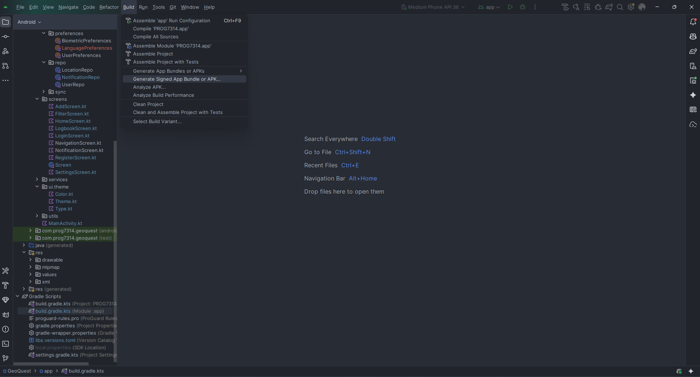

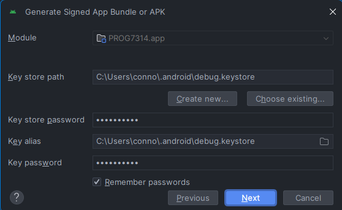
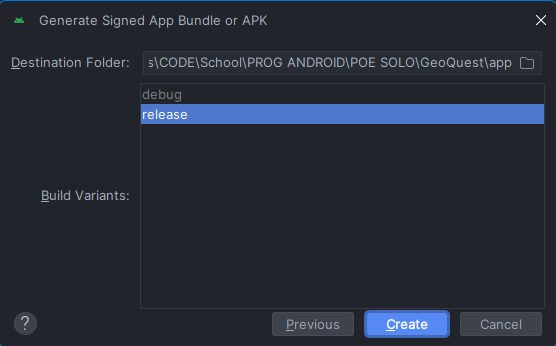
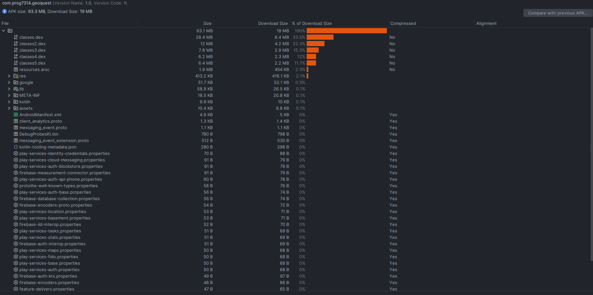

**APK Information**:

- **Package Name**: `com.prog7314.geoquest`
- **Version Code**: [Current version]
- **Version Name**: 2.0
- **Min SDK**: 24
- **Target SDK**: 34

### Publication Status

- ✅ App bundle generated
- ✅ Signed with release keystore
- ✅ Ready for Play Store upload

---

## 🧑‍💻 Developer Information

**Connor Gray**  
**Lead Programmer**  
_IIE Varsity College – BSc Computer Science (Application Development)_  
Cape Town, South Africa

- **GitHub**: [https://github.com/GrayCon1](https://github.com/GrayCon1)

### Development Timeline

- **Part 1**: Research, Planning and Design
- **Part 2**: App Prototype Development
- **Final POE**: Feature additions, improvements, and finalization

### Acknowledgments

- **Module**: PROG7314 - Programming 3D
- **Institution**: IIE Varsity College
- **AI Tools Used**: ChatGPT for research and coding suggestions, Claude 4.5 for error fixing, Gemini 2.5 Flash for terminal debugging

---

## 📄 License

This project is developed as part of the **PROG7314** module and is intended for academic use.

---

## 📸 Screenshots

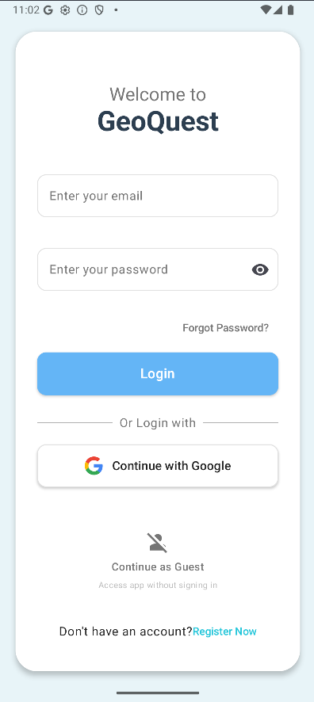
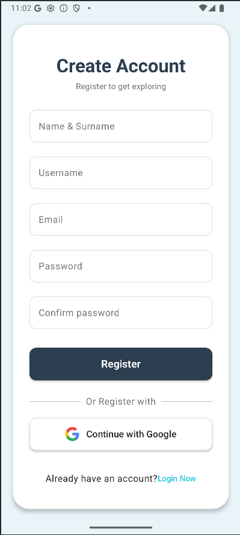
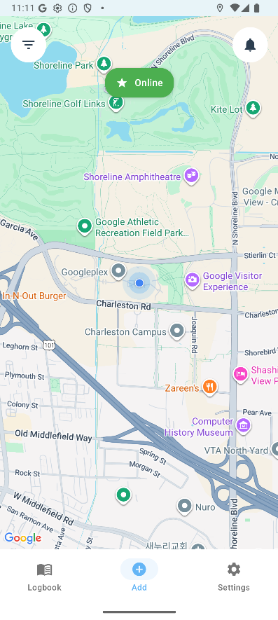
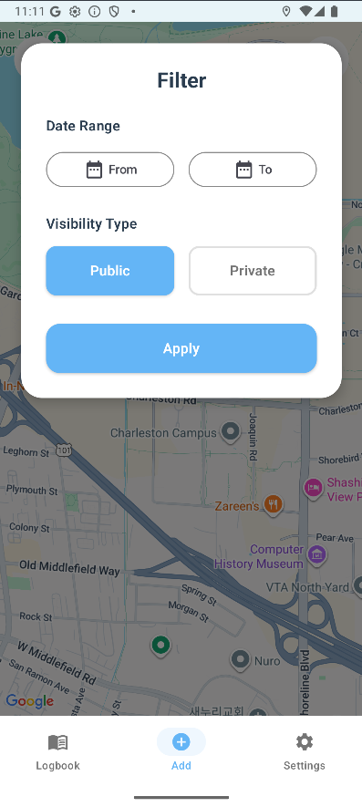
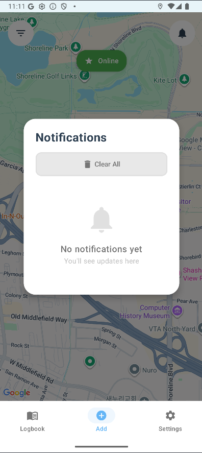
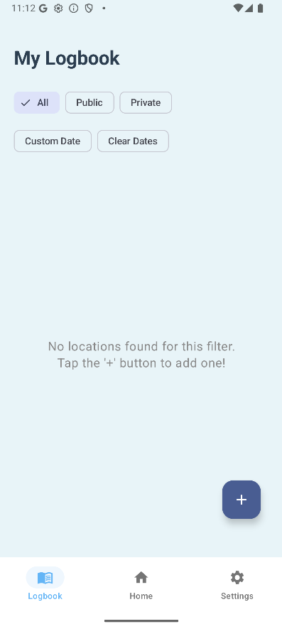
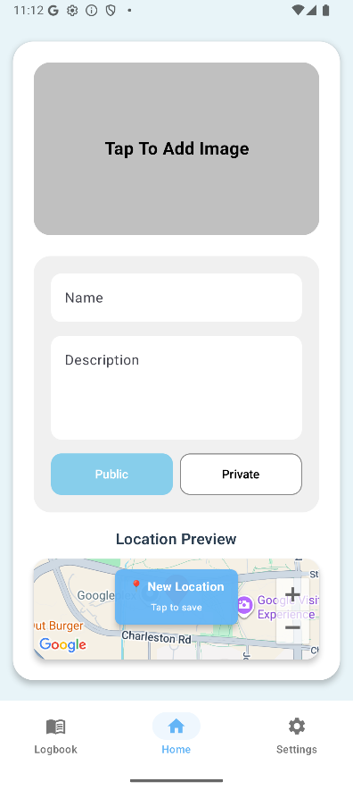
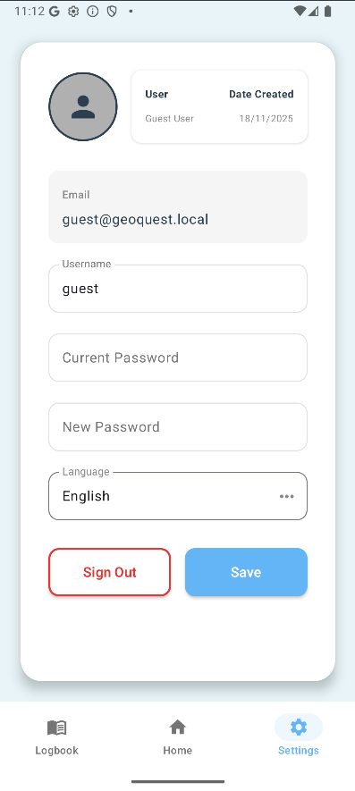
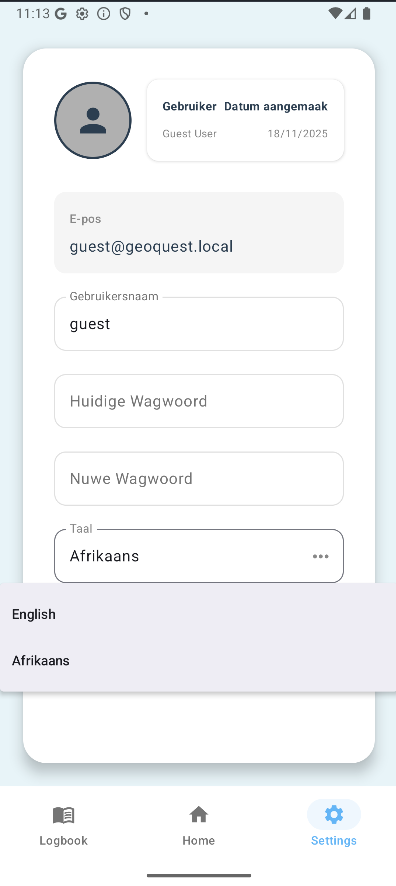

---

## 🔗 Additional Resources

- [Firebase Documentation](https://firebase.google.com/docs)
- [Android Developer Guide](https://developer.android.com/guide)
- [Jetpack Compose Tutorial](https://developer.android.com/jetpack/compose/tutorial)
- [Room Database Guide](https://developer.android.com/training/data-storage/room)
- [Firebase Cloud Messaging](https://firebase.google.com/docs/cloud-messaging)

---

**Last Updated**: [11/18/2025]  
**Version**: 2.0
